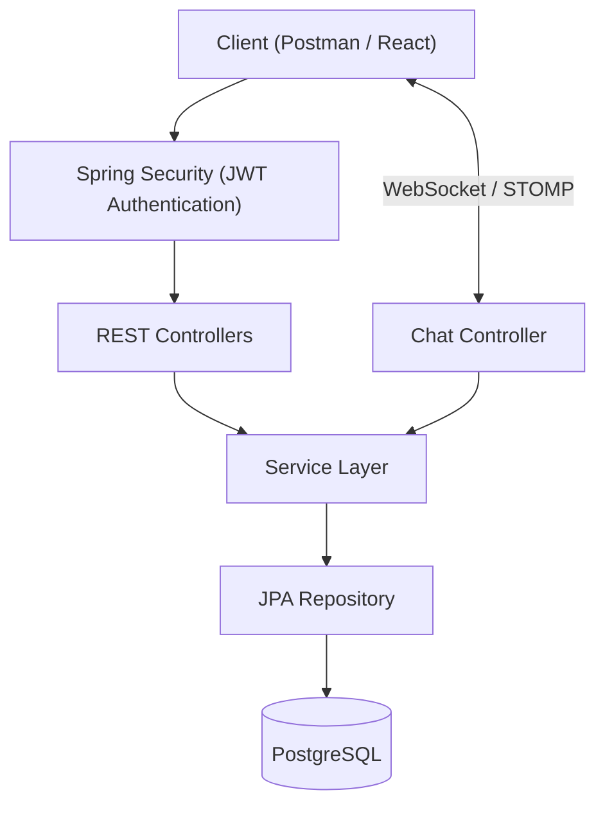

# Interest Connect

> A real-time networking platform that enables users to connect through shared interests and engage in secure one-to-one conversations.

---

## Overview

Interest Connect is a backend application that connects people based on common interests rather than existing social relationships.

Users can create discussion topics, discover topics posted by others, send connection requests, and communicate through real-time one-to-one chat after a connection request is accepted.

The application is built using Spring Boot with JWT authentication, PostgreSQL, WebSockets (STOMP), and Docker.

---

## Features

- Secure user registration and login using JWT authentication
- Create, update, search, close, and delete discussion topics
- Search topics using tags
- Send and receive connection requests
- Accept or reject connection requests
- Automatic conversation creation after request acceptance
- Secure one-to-one real-time chat using WebSocket (STOMP)
- Persistent message storage in PostgreSQL
- Read and unread message tracking
- Global exception handling
- Interactive API documentation using Swagger/OpenAPI
- Dockerized application using Docker Compose

---

## Tech Stack

### Backend
- Java 21
- Spring Boot 3
- Spring Security
- Spring Data JPA
- Hibernate

### Database
- PostgreSQL

### Authentication
- JWT (JSON Web Token)

### Real-Time Communication
- WebSocket
- STOMP

### Documentation
- Swagger / OpenAPI

### Build & Deployment
- Maven
- Docker
- Docker Compose

### Tools
- IntelliJ IDEA
- Git
- GitHub
- Postman

---

# Architecture



---

# Project Structure

```text
interest-connect
│
├── auth
├── common
├── config
├── connection
├── conversation
├── message
├── security
├── topic
├── user
├── websocket
│
├── Dockerfile
├── docker-compose.yml
├── README.md
└── pom.xml
```

---

# Project Status

🚧 **Active Development**

The backend foundation (Version 1) is complete and includes authentication, topic management, connection requests, real-time messaging, API documentation, and Docker support.

The project will continue to evolve with new features and architectural improvements in future releases.

---

# Vision

Interest Connect is more than a discussion platform. The long-term vision is to build an intelligent networking ecosystem where people discover meaningful connections through shared interests and receive personalized content based on their engagement.

Instead of relying solely on traditional social graphs, the platform aims to understand user interests, build communities around them, and create a personalized experience using data-driven recommendations.

---

# Product Roadmap

## Version 1 (Current)

- Secure authentication using JWT
- Topic creation and discovery
- Connection requests
- One-to-one conversations
- Real-time chat using WebSockets
- Swagger API documentation
- Dockerized deployment

---

## Version 2

### Interest Subscriptions

Allow users to follow topics or interest tags they care about.

Whenever a new discussion is created under those tags, subscribed users receive notifications and can immediately discover relevant content.

---

### Personalized Feed

Build a dynamic home feed that ranks discussions using factors such as:

- User interests
- Recent activity
- Trending topics
- Community engagement

instead of simply displaying topics in chronological order.

---

### Intelligent User Clustering

Group users into interest-based communities by analyzing:

- Topics created
- Tags followed
- Conversations
- User activity

These clusters will enable better content discovery and improve networking opportunities.

---

### Personalized Advertisements

Use anonymous interest clusters to deliver advertisements that are relevant to each user's interests.

Rather than showing generic advertisements, the platform aims to recommend products and services aligned with the communities a user actively participates in.

---

## Version 3

As the platform grows, future versions will focus on scalability and distributed system design, including:

- Redis caching
- Kafka event streaming
- Notification service
- Recommendation engine
- Advanced search
- Analytics pipeline
- Cloud-native deployment
- Monitoring and observability
- Microservices architecture


---

# Author

**Abhinav Reddy**

Software Engineer | Backend & Distributed Systems Enthusiast

I enjoy building scalable backend systems and continuously evolving this project to explore modern software engineering concepts, distributed systems, and real-time applications.

- GitHub: https://github.com/<your-github-username>
- LinkedIn: https://www.linkedin.com/in/<your-linkedin-profile> *(Optional)*

If you have suggestions, feedback, or would like to collaborate, feel free to open an issue or connect with me on GitHub.